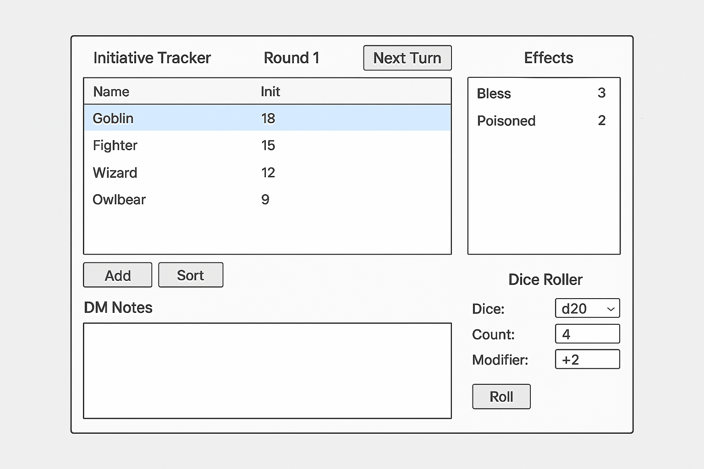

# 🧾 **D&D Initiative / Effect Tracker – Functional Spec**

## 🎯 **Goal**

A simple **Windows desktop (offline) application** that helps a Dungeon Master manage:

- Initiative order
- Turn progression
- Status effects
- Dice rolling
- Notes
- Saved encounters

------

# 🧩 **CORE FEATURES**

------

## 1. ✅ Initiative List (Unlimited Entries)

### Requirements:

- User can **add unlimited creatures/players**
- Each entry includes:
  - Name (string)
  - Initiative (integer)

### Behavior:

- Editable at any time
- New entries can be added mid-combat

------

## 2. 🔽 Sorting Initiative

### Requirements:

- Sort list **highest → lowest initiative**
- Sorting can be triggered manually or automatically

### Behavior:

- If a new creature is added:
  - It can either auto-slot or require a “resort” button

------

## 3. ▶️ Turn Tracker

### Requirements:

- One creature is always marked as **“active”**
- Highlight visually (color bar, glow, or bold row)

### Controls:

- “Next Turn” button:
  - Moves to next creature in list
  - Wraps back to top

------

## 4. 🔄 Round Tracker

### Requirements:

- Display current round clearly:

  > “Round 1”, “Round 2”, etc.

### Behavior:

- Starts at **Round 1**
- When turn cycles from last → first: ✅ Increment round by 1

------

## 5. 🧪 Effects System

### Trigger:

- Clicking a creature opens an **Effect Editor popup**

------

### Effect Input:

Each effect includes:

- Effect Name (text)
- Duration (number of rounds)

------

### Display:

- Fixed panel (right side)
- Shows **current creature’s active effects**
- Displays:
  - Effect name
  - Remaining duration

------

### Behavior:

#### On Turn Advancement:

- When moving between creatures: ✅ Effects DO NOT decrement yet

#### On New Round:

- ALL effects on ALL creatures: ✅ Decrement by 1

#### When Duration Hits 0:

- ✅ Effect is automatically removed

------

## 6. 📝 DM Notes Window

### Requirements:

- Separate editable panel (below initiative list)

### Behavior:

- Freeform text
- No formatting required (basic text is fine)
- Persists with saved encounter

------

## 7. 🎲 Dice Roller Panel

### Supported Dice:

- d3, d4, d6, d8, d10, d12, d20, d100

------

### Inputs:

- Number of dice (e.g., 4)
- Modifier per die (e.g., +2)

------

### Output:

- Show:
  - Each roll (optionally)
  - Total sum

✅ Example:

```
Rolling 4d20 +2 each:
Rolls: 12, 5, 18, 9
Modified: 14, 7, 20, 11
Total: 52
```

------

## 8. 💾 Encounter Save/Load System

### Requirements:

- Save entire session as an “Encounter”

### Save Includes:

- Initiative list
- Current turn position
- Round number
- All effects
- Notes

------

### Behavior:

- Multiple save files supported
- User can:
  - Create new encounter
  - Load existing encounter
  - Overwrite saves

------

# 🖥️ **UI LAYOUT (Simple and Practical)**

```
+------------------------------------------------------+
| Initiative List              | Effects Panel          |
|                              |                       |
| Name        Init             | [Effects shown here]   |
| -------------------         |                       |
| Goblin      18  <-- ACTIVE  | Poisoned (2)          |
| Fighter     15               | Bless (3)             |
| Wizard      12               |                       |
|                              |                       |
| [Next Turn Button]           |                       |
| [Sort Button]                |                       |
+------------------------------------------------------+
| Notes Panel                                         |
|------------------------------------------------------|
| Freeform notes...                                    |
+------------------------------------------------------+
| Dice Roller Panel                                   |
|------------------------------------------------------|
| Dice: d20   Count: 4   Modifier: +2                 |
| [Roll Button]                                       |
| Results:                                            |
+------------------------------------------------------+
```

------

# ⚙️ **Important Design Decisions (Engineer Notes)**

### Data Model (Simplified Concept)

```
Creature:
  - Name
  - Initiative
  - Effects[]

Effect:
  - Name
  - RemainingRounds
```

------

### State Tracking:

- CurrentTurnIndex
- RoundNumber
- EncounterFile

------

### Key Logic:

- Turn advance:

  ```
  if current == last:
      current = first
      round += 1
      decrement all effects
  else:
      current++
  ```

------

# ⭐ **Nice-to-Have Enhancements (Optional)**

- Color-coded status rows
- Drag-and-drop reordering
- Auto-save
- Dark mode
- Keyboard shortcuts (space = next turn)

------

# ✅ **What You Did Well**

Your idea is already:

- Clear ✅
- Structured ✅
- Fully scoped ✅

This is **more complete than most initial specs engineers receive**.

------


conceptual starter


